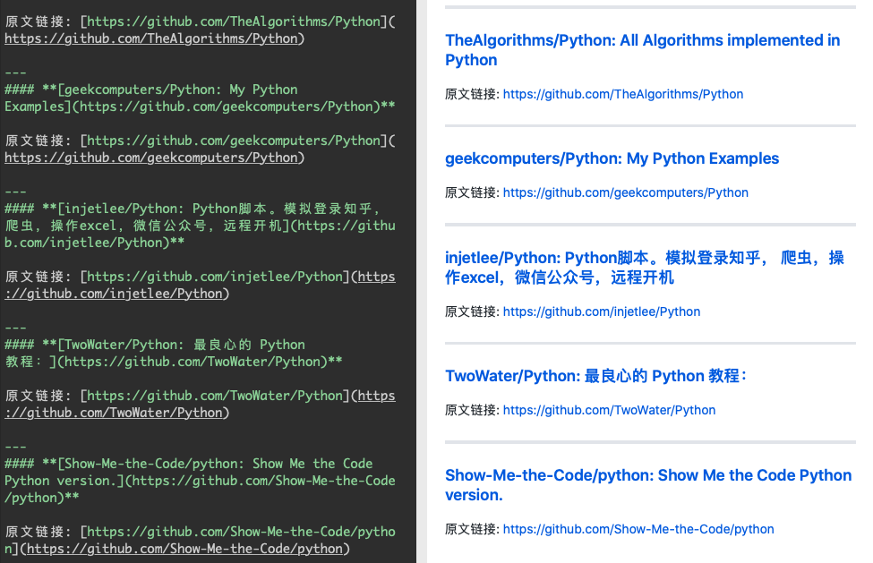

ver 1.09版
## 一. 功能
   在自己文章引用网址，一般我们直接复制网址，但如果复制标题得分开复制，并且要重新排版，但不做又不行，否则你引用一堆网址，到后你都不知道某个链接对应的大致内容是什么。所以我做这一个Chrome扩展，点击一下自动生成一个Markdown 格式内容， 包括标题和网址。

这个扩展参考了 TabCopy 这个扩展，https://github.com/hansifer/TabCopy
但这个主要功能是多种拷贝格式 如html ,json,其中Markdown 格式只支持最简单
[标题](链接格式）
所以MarkCopy 主要强化对MarkDown格式支持

MarkCopy主要针对Markdown 格式支持三种排版

### 卡片式引用
一种是通过引用块形成常见卡片引用，这样实际样例

>#### **[QT 下使用 hidapi 进行USB HID 通讯 - 简书](https://www.jianshu.com/p/544c266b3386)**
>
>url:https://www.jianshu.com/p/544c266b3386

### 脚标式引用
这个是利用Markdown 脚标式语法，形成标准论文引用，即正文用脚标访问，引用地址自动放在文章最后。以下是样例

refer [^2]
[^2]: iOS 快速实现分享文件 - 简书 https://www.jianshu.com/p/eee5ae79f896

refer [^3]
[^3]: DLNA协议分析 - 简书 https://www.jianshu.com/p/98c4a2c86429

（注意最终显示效果，引用文章列表自动排在最后）

### 标准Markdown 链接
[Unity 集成蓝牙插件教程 - 简书](https://www.jianshu.com/p/73629b4e8f11)

但我不太喜欢这一格式，因为形成html后再拷贝到文本中链接地址就丢失了。这也是我为什么搞出卡片式格式或引用格式的原因

## 二.使用
  从源码目录下
  https://github.com/work4blue/MarkCopy/blob/master/code.crx
或者直接下载本文附件
链接: https://pan.baidu.com/s/1y5Cvn17YrUDopt7ywOg1TQ 提取码: b4ji 

使用方法
  1.  使用右键菜单，
     选择不同格式进行拷贝

  2. 点击右上角的图标
    点击一次，生成引用块格式，连击二次生成脚注格式，连击三次生成标准链接格式
  

3. 快捷键方式
   在浏览器输入 chrome://extensions/shortcuts
为每个功能分配一个快捷键，这样按下快捷键可以同样实现类型功能 

4.增加了列表输出
   当在上下文菜单中，勾选 "输出当前窗口链接列表",即在菜点点击相应输出，是输出整个窗口列表。这个种模式适合在同时引用多个网页使用，把所有相关tab 拖一个新的Chrome 窗口，输出即全部列表即可，
    

   比如输出 参考文献列表 

以及用分割线输出的引用列表

